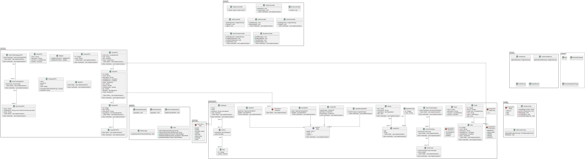
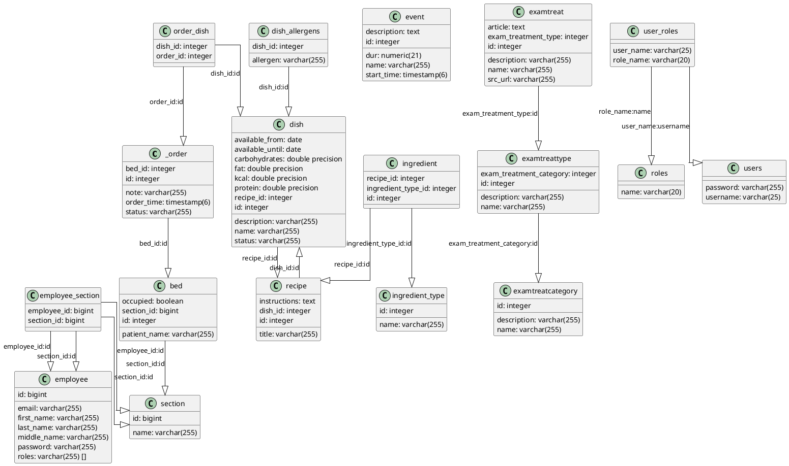

# SYSDAT F25 PROJEKT - Patient Assist

# Links

  - [frontend project](https://github.com/SYSDAT-PATIENT-ASSIST/FrontEnd)

# How To

  1. clone this repo, make sure you are on the `main` branch (this is the default)
  2. make sure, that you have a postgresql server listening on port 5432, with a database name `patient_assist_db` owned by the user `postgres` with password `postgres`
  3. open the project in Intellij and run the main methods in the following files (in order):
```
dk/patientassist/PopulateIngredientType
dk/patientassist/PopulateDatabase
dk/patientassist/App.main
```

# Configuration

Main configuration file:  
📄 `src/main/resources/config.properties`

# Class Diagram

*Note that not all methods and fields are included, only the ones deemed noteworthy or integral to the classes.*

[](https://github.com/SYSDAT-PATIENT-ASSIST/BackEnd/blob/main/docs/class-diagram-v2.png?raw=true)

# Database Diagram

[](https://github.com/SYSDAT-PATIENT-ASSIST/BackEnd/blob/main/docs/ERD.png?raw=true)
